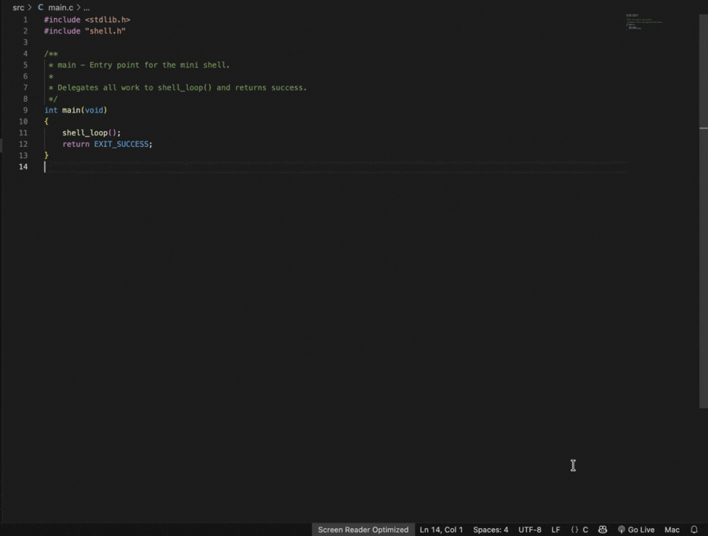

# Linux Mini Shell


## 📌 Project Description
A lightweight, professional, POSIX-compliant UNIX CLI application written in C from scratch. This project demonstrates core operating system concepts such as process creation, inter-process communication (IPC), file descriptor manipulation, and robust signal handling. It closely mirrors the behavior of standard shells like `bash` or `sh` while remaining modular, highly documented, and extremely easy to install.

## 🎥 Demo



## ✨ Features
- **Execution:** Runs standard foreground and background (`&`) processes.
- **Pipelining:** Supports unlimited chained pipelines (e.g., `ls -l | grep src | wc -l`).
- **I/O Redirection:** Handles input (`<`), output (`>`), and append (`>>`) file redirection.
- **Built-in Commands:** `cd`, `exit`, and `history`.
- **Signal Handling:** Gracefully handles `SIGINT` (Ctrl+C) without crashing, and automatically reaps background zombie processes via `SIGCHLD`.
- **CLI Options:** Supports standard `--help` and `--version` flags.

## 🏗️ Architecture Overview
The shell is built with a clean, modular architecture separating concerns across dedicated C modules:
- **`shell.c`**: The main REPL (Read-Eval-Print Loop).
- **`parser.c`**: Parses raw string input into structured `Command` data objects.
- **`execute.c`**: Handles single-command `fork()` and `execvp()` logic.
- **`pipe.c`**: Orchestrates `N-1` pipes for `N` commands, chaining standard I/O streams.
- **`redirect.c`**: Manages file opens and `dup2()` descriptor mapping.
- **`signals.c`**: Installs isolated signal handlers and manages state restoration for child processes.
- **`builtin.c` & `history.c`**: Implements internal commands and memory-managed command history.

## 📂 Folder Structure
```text
linux-mini-shell/
├── Makefile
├── README.md
├── CHANGELOG.md
├── CONTRIBUTING.md
├── docs/
├── assets/
├── tests/
├── include/
└── src/
```

## 🛠️ System Calls Used
This project extensively utilizes UNIX system calls to interface directly with the kernel:
- **Process Management**: `fork()`, `execvp()`, `waitpid()`
- **IPC & Pipes**: `pipe()`, `dup2()`
- **File I/O**: `open()`, `close()`, `read()`, `write()`
- **Signals**: `signal()`, `sigaction()`, `kill()`
- **Environment**: `chdir()`

## 🚀 Build & Run

To build and run the project locally, ensure you have `gcc` and `make` installed.

```bash
# Clone the repository
git clone https://github.com/HarshEvolves/linux-mini-shell.git
cd linux-mini-shell

# Build the project
make

# Run the shell
./minishell
```

## ⚡ Quick Start

```bash
# Display help menu
./minishell --help

# Check version
./minishell --version
```

## 💡 Usage Examples

```bash
myshell$ pwd
/Users/harsh/linux-mini-shell

myshell$ ls
Makefile  README.md  src  include  tests  assets  docs

myshell$ echo Hello
Hello

myshell$ echo Hello > out.txt

myshell$ cat out.txt
Hello

myshell$ ls | grep main
main.c
```

## 🚀 Future Improvements
- **Logical Operators:** Support for `&&` and `||`.
- **Job Control:** Implementation of `fg`, `bg`, and `jobs` commands using `SIGTSTP`.
- **Quoting & Escaping:** Support for parsing strings containing spaces inside double/single quotes.
- **Environment Variables:** Support for expanding `$VAR` variables and `export`.

## 🤝 Contributing
Contributions are always welcome! Please see [CONTRIBUTING.md](CONTRIBUTING.md) for details on how to get started.

## 📄 License
This project is open-source. See the `LICENSE` file for details.